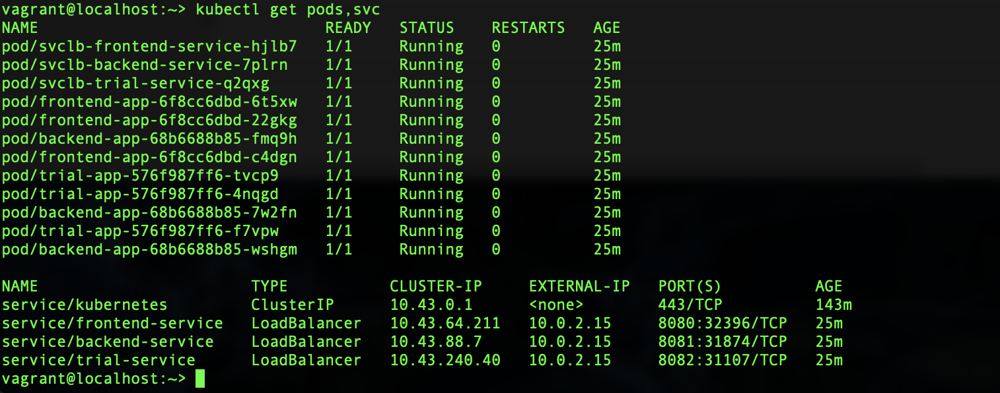
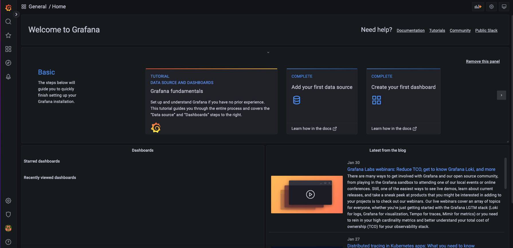
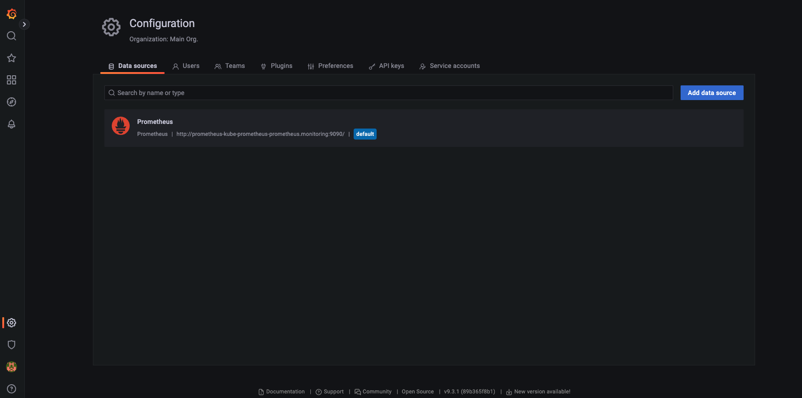
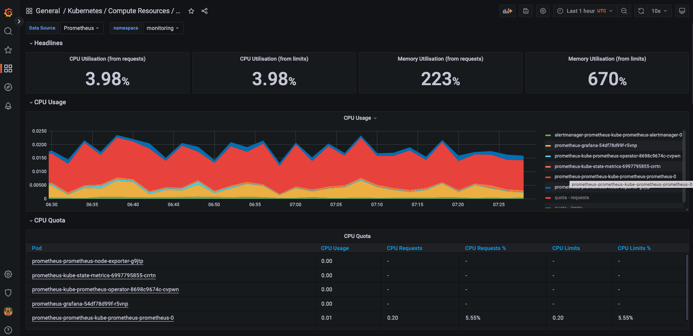
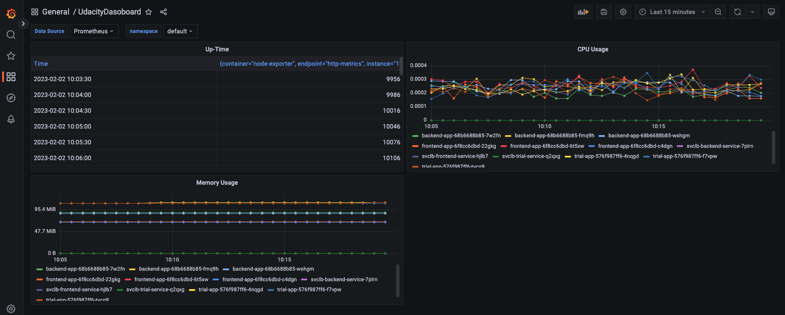
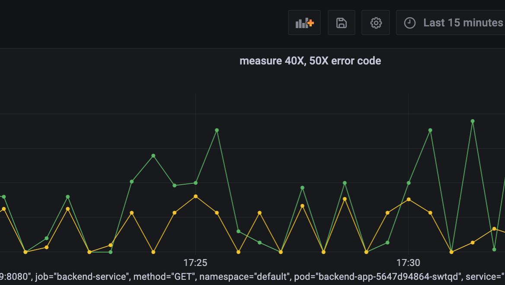
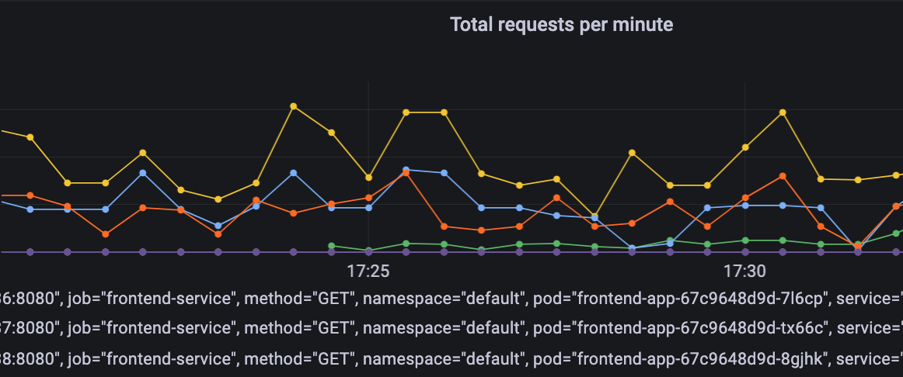
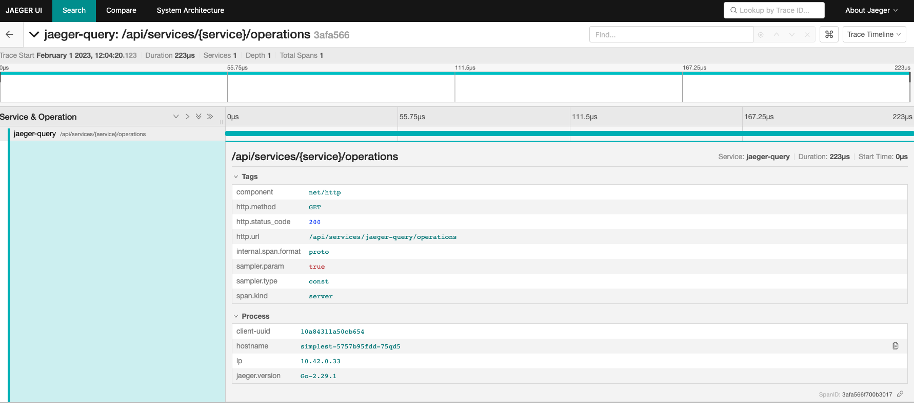
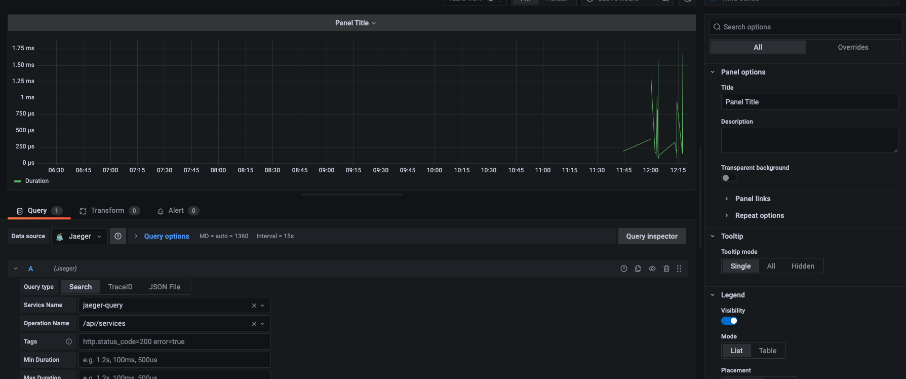

**Note:** For the screenshots, you can store all of your answer images in the `answer-img` directory.

## Installation commands

### Install Helm

curl https://raw.githubusercontent.com/helm/helm/master/scripts/get-helm-3 | bash

### Installing Grafana and Prometheus

kubectl create namespace monitoring
helm repo add prometheus-community https://prometheus-community.github.io/helm-charts
#### helm repo add stable https://kubernetes-charts.storage.googleapis.com # this is deprecated
helm repo add stable https://charts.helm.sh/stable
helm repo update
helm install prometheus prometheus-community/kube-prometheus-stack --namespace monitoring --kubeconfig /etc/rancher/k3s/k3s.yaml
#### Exposing Grafana

##### Verify that it installed
kubectl get pods,svc --namespace=monitoring

##### You can port-forward this by running the following command
kubectl port-forward service/prometheus-grafana --address 0.0.0.0 3000:80 -n monitoring

### Jaeger

#### create namespace observability
kubectl create namespace observability
#### Please use the last stable version
export jaeger_version=v1.28.0 
kubectl create -f https://raw.githubusercontent.com/jaegertracing/jaeger-operator/${jaeger_version}/deploy/crds/jaegertracing.io_jaegers_crd.yaml
kubectl create -n observability -f https://raw.githubusercontent.com/jaegertracing/jaeger-operator/${jaeger_version}/deploy/service_account.yaml
kubectl create -n observability -f https://raw.githubusercontent.com/jaegertracing/jaeger-operator/${jaeger_version}/deploy/role.yaml
kubectl create -n observability -f https://raw.githubusercontent.com/jaegertracing/jaeger-operator/${jaeger_version}/deploy/role_binding.yaml
kubectl create -n observability -f https://raw.githubusercontent.com/jaegertracing/jaeger-operator/${jaeger_version}/deploy/operator.yaml

#### Cluster wide Jaeger
kubectl create -f https://raw.githubusercontent.com/jaegertracing/jaeger-operator/${jaeger_version}/deploy/cluster_role.yaml
kubectl create -f https://raw.githubusercontent.com/jaegertracing/jaeger-operator/${jaeger_version}/deploy/cluster_role_binding.yaml


## Verify the monitoring installation

Run `kubectl` command to show the running pods and services for all components. Take a screenshot of the output and include it here to verify the installation
```
kubectl get svc --namespace=monitoring
kubectl get svc --namespace=observability
kubectl get pods --namespace=monitoring
kubectl get pods --namespace=observability
kubectl get pods
```



## Setup the Jaeger and Prometheus source
Expose Grafana to the internet and then setup Prometheus as a data source. Provide a screenshot of the home page after logging into Grafana.

```
kubectl apply -n observability -f - <<EOF
apiVersion: jaegertracing.io/v1
kind: Jaeger
metadata:
 name: simplest
EOF
```


## Create a Basic Dashboard
Create a dashboard in Grafana that shows Prometheus as a source. Take a screenshot and include it here.







## Describe SLO/SLI
Describe, in your own words, what the SLIs are, based on an SLO of *monthly uptime* and *request response time*.

```
A Service-Level Indicator (SLI) is a  metric used to measure the performance of a service. It could be something like the service was up 90% of the time in the last one month. Average response time in last month etc. 
```

## Creating SLI metrics.
It is important to know why we want to measure certain metrics for our customer. Describe in detail 5 metrics to measure these SLIs. 
```
1. Response time of requests
2. Amount of CPU and RAM usage
3. The average bandwidth in a specifi period of time
4. Time a service is active
5. Amount of failures in a unit of time

```


## Create a Dashboard to measure our SLIs
Create a dashboard to measure the uptime of the frontend and backend services We will also want to measure to measure 40x and 50x errors. Create a dashboard that show these values over a 24 hour period and take a screenshot.






## Tracing our Flask App
Create a Jaeger span to measure the processes on the backend. Once you fill in the span, provide a screenshot of it here. 
Also provide a (screenshot) sample Python file containing a trace and span code used to perform Jaeger traces on the backend service.

```

kubectl port-forward svc/backend-service 8081:8081

# Run some request to the api endpoint
for i in 0 1 2 3 4 5 6 7 8 9; do curl localhost:8081/api; done

kubectl port-forward -n observability  service/simplest-query --address 0.0.0.0 16686:16686

```



## Jaeger in Dashboards
Let's add the metric to our current Grafana dashboard.



## Report Error
*TODO:* Using the template below, write a trouble ticket for the developers, to explain the errors that you are seeing (400, 500, latency) and to let them know the file that is causing the issue also include a screenshot of the tracer span to demonstrate how we can user a tracer to locate errors easily.

TROUBLE TICKET

Name: Request endpoint star fail throw 405 Method Not Allowed

Date: Feb 01 2023, 17:30 PM

Subject: Backend can't acces MongoDB

Affected Area: Backend Service

Severity: High

Description: As we port-forwarding the application accessing /star endpoint, it throw 405 error which is caused by the mongodb://example-mongodb-svc.default.svc.cluster.local:27017/example-mongodb URL is not exist in the cluster. We need to make the MongoDB URL available for the cluster.


## Creating SLIs and SLOs

* Create an SLO guaranteeing that our application has a 99.95% uptime per month. Name three SLIs that you would use to measure the success of this SLO.  
   - Latency: The response time of requests should less than 30ms within a month.
   - Failure rate: Ensure that the status code 2xx rates are around 97%.
   - Uptime: Uptime nedd to be approximate 99 percent within a month and response time should be around 500 milliseconds.


## Building KPIs for our plan

* Now that we have our SLIs and SLOs, create KPIs to accurately measure these metrics. We will make a dashboard for this, but first write them down here.  
   - Latency: Response time.  
   - Failure rate: Errors per second / response rate per second.    
   - Uptime: Sucessful requests during pod uptime.  
   - Network capcity: successful request per second /  request per second.  
   - Resource capcity: CPU, RAM usage per pod.  


## Final Dashboard
*TODO*: Create a Dashboard containing graphs that capture all the metrics of your KPIs and adequately representing your SLIs and SLOs. Include a screenshot of the dashboard here, and write a text description of what graphs are represented in the dashboard.  


Uptime: Uptime of each pod.
Requests per second: Number of successful Flask requests per second.
Errors per second: Number of failed (non HTTP 200) responses per second.
Total requests per minute: The total number of requests measured within one minute.
Memory usage: The memory usage of the Flask app.
Jaeger Spans: Tracing Backend Service using Jaeger.