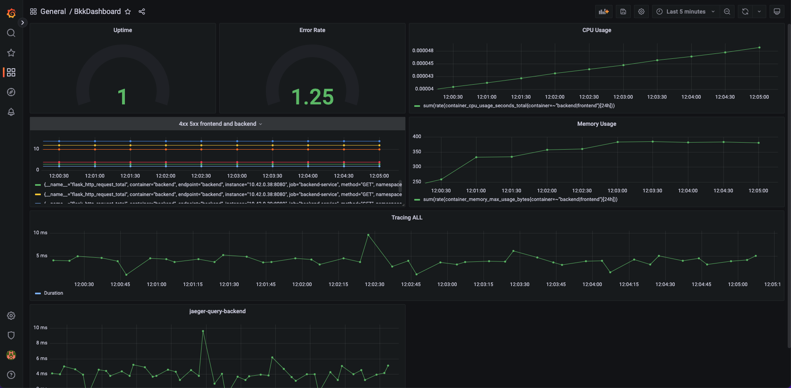
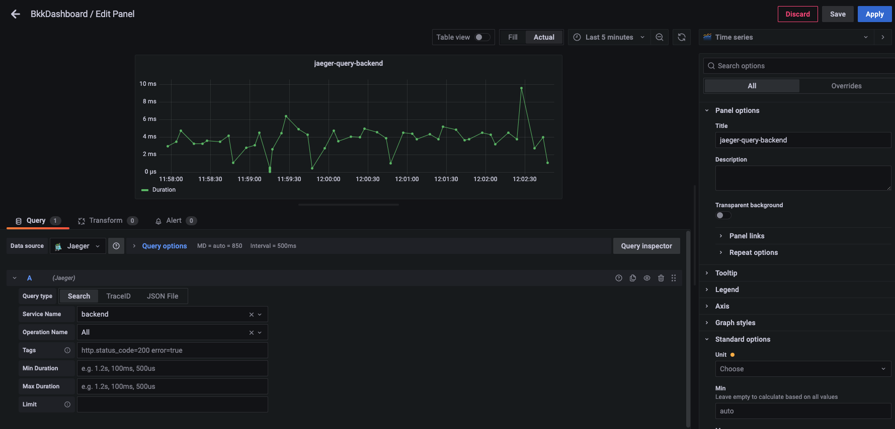

**Note:** For the screenshots, you can store all of your answer images in the `answer-img` directory.

## Installation commands

### Install Helm

curl https://raw.githubusercontent.com/helm/helm/master/scripts/get-helm-3 | bash

### Installing Grafana and Prometheus

kubectl create namespace monitoring
helm repo add prometheus-community https://prometheus-community.github.io/helm-charts
#### helm repo add stable https://kubernetes-charts.storage.googleapis.com # this is deprecated
helm repo add stable https://charts.helm.sh/stable
helm repo update
helm install prometheus prometheus-community/kube-prometheus-stack --namespace monitoring --kubeconfig /etc/rancher/k3s/k3s.yaml
#### Exposing Grafana

##### Verify that it installed
kubectl get pods,svc --namespace=monitoring

##### You can port-forward this by running the following command
kubectl port-forward service/prometheus-grafana --address 0.0.0.0 3000:80 -n monitoring

### Jaeger

#### create namespace observability
kubectl create namespace observability
#### Please use the last stable version
export jaeger_version=v1.28.0 
kubectl create -f https://raw.githubusercontent.com/jaegertracing/jaeger-operator/${jaeger_version}/deploy/crds/jaegertracing.io_jaegers_crd.yaml
kubectl create -n observability -f https://raw.githubusercontent.com/jaegertracing/jaeger-operator/${jaeger_version}/deploy/service_account.yaml
kubectl create -n observability -f https://raw.githubusercontent.com/jaegertracing/jaeger-operator/${jaeger_version}/deploy/role.yaml
kubectl create -n observability -f https://raw.githubusercontent.com/jaegertracing/jaeger-operator/${jaeger_version}/deploy/role_binding.yaml
kubectl create -n observability -f https://raw.githubusercontent.com/jaegertracing/jaeger-operator/${jaeger_version}/deploy/operator.yaml

#### Cluster wide Jaeger
kubectl create -f https://raw.githubusercontent.com/jaegertracing/jaeger-operator/${jaeger_version}/deploy/cluster_role.yaml
kubectl create -f https://raw.githubusercontent.com/jaegertracing/jaeger-operator/${jaeger_version}/deploy/cluster_role_binding.yaml


## Verify the monitoring installation

Run `kubectl` command to show the running pods and services for all components. Take a screenshot of the output and include it here to verify the installation
```
kubectl get svc --namespace=monitoring
kubectl get svc --namespace=observability
kubectl get pods --namespace=monitoring
kubectl get pods --namespace=observability
kubectl get pods
```


## Setup the Jaeger and Prometheus source
Expose Grafana to the internet and then setup Prometheus as a data source. Provide a screenshot of the home page after logging into Grafana.

```
kubectl apply -n observability -f - <<EOF
apiVersion: jaegertracing.io/v1
kind: Jaeger
metadata:
 name: simplest
EOF
```


## Create a Basic Dashboard
Create a dashboard in Grafana that shows Prometheus as a source. Take a screenshot and include it here.




## Describe SLO/SLI
Describe, in your own words, what the SLIs are, based on an SLO of *monthly uptime* and *request response time*.

```
A Service-Level Indicator (SLI) is a  metric used to measure the performance of a service. It could be something like the service was up 90% of the time in the last one month. Average response time in last month etc. 
```

## Creating SLI metrics.
It is important to know why we want to measure certain metrics for our customer. Describe in detail 5 metrics to measure these SLIs. 
```
1) Latency.the time taken to respond to a request.
2) Uptime.time of availability of the app
3) CPU Utilization
4) Network Capacity. average bandwidth in month
5) memory usage

```


## Create a Dashboard to measure our SLIs
Create a dashboard to measure the uptime of the frontend and backend services We will also want to measure to measure 40x and 50x errors. Create a dashboard that show these values over a 24 hour period and take a screenshot.


## Tracing our Flask App
Create a Jaeger span to measure the processes on the backend. Once you fill in the span, provide a screenshot of it here. 
Also provide a (screenshot) sample Python file containing a trace and span code used to perform Jaeger traces on the backend service.

```

kubectl -n observability  port-forward  service/bkk-traces-query --address 0.0.0.0 16686:16686
for i in 1 2 3 4 5 6 7 8 9; do curl localhost:8081; done


kubectl --namespace monitoring port-forward svc/prometheus-grafana --address 0.0.0.0 3000:80
Forwarding from 0.0.0.0:3000 -> 3000

bkk-traces-query.observability.svc.cluster.local:16686


```



## Jaeger in Dashboards
Let's add the metric to our current Grafana dashboard.


## Report Error
Using the template below, write a trouble ticket for the developers, to explain the errors that you are seeing (400, 500, latency) and to let them know the file that is causing the issue also include a screenshot of the tracer span to demonstrate how we can user a tracer to locate errors easily.

TROUBLE TICKET

Name: error when call /error-500 endpoint

Date: Feb 04 2023, 11:54:45.577

Subject: request not successfully completed

Affected Area: backend

Severity: critical

Description: when call the star endpoint it return 500 status code so we need to return the response 200. that is critical because it may we can't make DB connection


## Creating SLIs and SLOs

* Create an SLO guaranteeing that our application has a 99.95% uptime per month. Name three SLIs that you would use to measure the success of this SLO.  

- Latency : 95% of the requests takes 30 - 40 ms to complete
- Uptime : 99.95% service should be available
- Error Rate : must be less than 0.5 % of 4xx or 5xx errors
- Resource Usage: CPU and RAM usage must not exceed 95% per month.


## Building KPIs for our plan

* Now that we have our SLIs and SLOs, create KPIs to accurately measure these metrics. We will make a dashboard for this, but first write them down here.  

- Latency : when the latency within the 30 - 40 that indicate of healthy application that have suitable memory to serve the client in month

performance - This KPI shows the application's overall performance.
Monthly uptime - This KPI shows the application's overall usability when the Latency avg per request is low or within 30 - 40 ms.

- Uptime : Due to our SLOs we want the application up 99.95% per month

Monthly downtime - This KPI shows the number of the downtime of the application.
Avg monthly Uptime - This KPI shows the application's overall usabilityThis KPI shows the application's overall usability .

- Error Rate : we want the application run without failure so we want the fail requests than 0.05% per month.

Monthly uptime - This KPI shows the application's overall usability when the failure rate is low.
50x code responses per month - this KPI shows downtime of the application.

- Resource Usage: To can see the consumption so let us know if we want to expand the resources to our solution or not in month.

Average monthly Resource usage of all the pods - This KPI was selected to show the total amount of resources utilized by all the pods needed to run the application.
Monthly quota limit - This KPI was selected to show whether the application is using more resources than its allotted quota.


## Final Dashboard
Dashboard containing graphs that capture all the metrics of your KPIs and adequately representing your SLIs and SLOs. Include a screenshot of the dashboard here, and write a text description of what graphs are represented in the dashboard.  


## Description of the dashboard:

- Uptime: the up time is 100 %
- Error Rate: the percentage of failed requests over success requests
- CPU Usage: CPU utilization by the service
- Memory Usage: Memory utilization by the service
- 50x, 40x Errors: 50x, 40x respond from our service